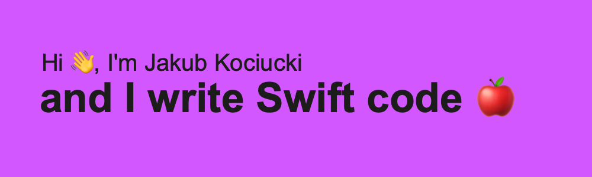

<br/><br/>


# About me 🤓

Pronouns: He/His.
-  I'm Jakub from Poland and I'm 22 years old 👦🏻  🇵🇱
-  For over 5 years I'm an Apple fanboy 🍎
-  I'm currently learning UIKit 👨🏻‍💻
-  My main goal is to land a first job as a Junior iOS Developer 💼
-  Funfact: In my free time I love to read and learn Czech language 🇨🇿
<br/><br/>

# How to reach me? 📬

[](https://twitter.com/KubaKociucki)  [](https://www.linkedin.com/in/jakub-kociucki/)  [](mailto:jakubkociucki.dev@gmail.com)
)
<br/><br/>

# Skills and technologies 💻


<br/><br/>

# Github Stats 💯

[](https://github.com/anuraghazra/github-readme-stats)
<br/><br/>

# Coding Stats 👨🏻‍💻
<!--START_SECTION:waka-->
```text
No Activity tracked this Week
```
<!--END_SECTION:waka-->
